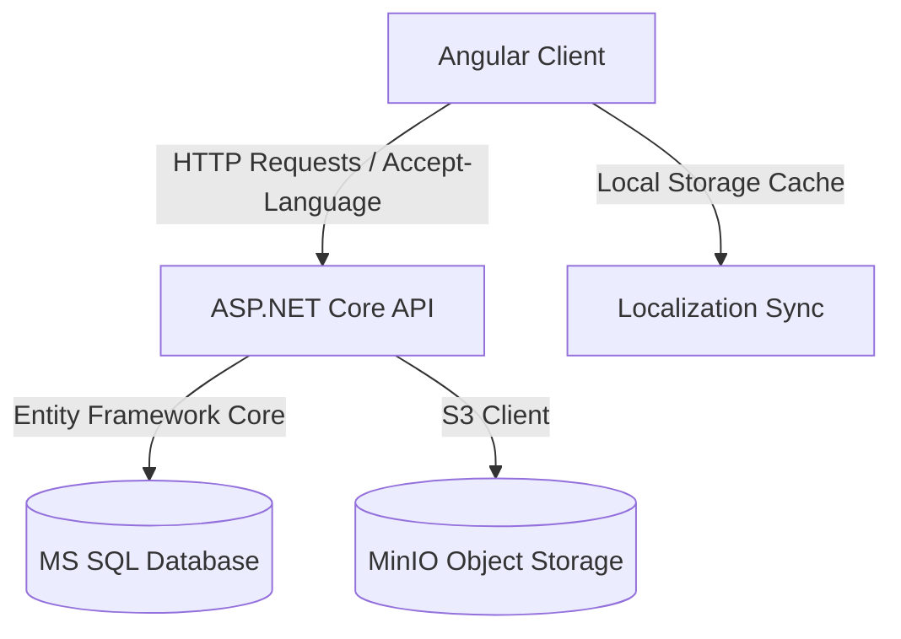
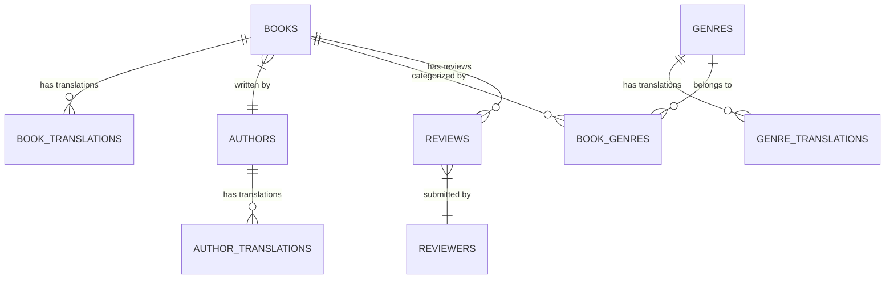

# Library Project Technical Overview

This document provides a detailed technical overview of the **Library** project, which consists of a **C# ASP.NET Core Web API Backend** and an **Angular 18 Standalone Frontend Client**. 

---

## 1. Project Architecture

The system follows a modern decoupled architecture:
* **Backend**: ASP.NET Core Web API exposing RESTful JSON endpoints. It uses Entity Framework (EF) Core for database management with MS SQL Server, JWT Bearer tokens for authentication, and MinIO (an S3-compatible object store) for storing book covers.
* **Frontend**: Angular 18 using standalone components, CSS custom styles, and Angular Signals for reactive state management.
* **Database & Infrastructure**: Configured via Docker Compose, including MS SQL Server and MinIO.



---

## 2. Backend Architecture (.NET Web API)

The backend code is organized into a clean multi-layered structure in the [Library project directory](file:///c:/Users/samko/source/repos/Library/Library).

### 2.1 Database Schema & Models
The data model consists of core entities representing the bookstore catalog, augmented by composite translation tables to support **database-level multi-language localization**.

#### Core Database Schema
* **User**: Tracks system users, passwords (hashed), and roles (e.g., Administrator). Managed via [User.cs](file:///c:/Users/samko/source/repos/Library/Library/Models/User.cs).
* **Book**: Tracks catalog items including title, page count, published date, and S3 cover image URLs. Managed via [Book.cs](file:///c:/Users/samko/source/repos/Library/Library/Models/Book.cs).
* **Author**: Represents book writers. Managed via [Author.cs](file:///c:/Users/samko/source/repos/Library/Library/Models/Author.cs).
* **Genre**: Categorizes books. Managed via [Genre.cs](file:///c:/Users/samko/source/repos/Library/Library/Models/Genre.cs).
* **Review & Reviewer**: Reader reviews containing text ratings (1-5 stars). Managed via [Review.cs](file:///c:/Users/samko/source/repos/Library/Library/Models/Review.cs) and [Reviewer.cs](file:///c:/Users/samko/source/repos/Library/Library/Models/Reviewer.cs).

#### Localization Tables
To support dynamic translations (Slovak `SK`, Greek `GR`, and English `EN`), entities map to translation tables with unique composite indices (`EntityId + LanguageCode`):
* [BookTranslation.cs](file:///c:/Users/samko/source/repos/Library/Library/Models/BookTranslation.cs): Stores localized title and description.
* [AuthorTranslation.cs](file:///c:/Users/samko/source/repos/Library/Library/Models/AuthorTranslation.cs): Stores localized name and surname.
* [GenreTranslation.cs](file:///c:/Users/samko/source/repos/Library/Library/Models/GenreTranslation.cs): Stores localized genre name.



### 2.2 Core Service Layer
The API delegates heavy lifting to specialized injectable services:
* [LanguageService.cs](file:///c:/Users/samko/source/repos/Library/Library/Services/LanguageService.cs): Resolves the client locale code from the incoming `Accept-Language` HTTP header, falling back to Slovak (`SK`) if unspecified.
* [S3BlobService.cs](file:///c:/Users/samko/source/repos/Library/Library/Services/S3BlobService.cs): Communicates with MinIO S3 bucket to store uploaded cover photos and returns access URLs.
* [TokenService.cs](file:///c:/Users/samko/source/repos/Library/Library/Services/TokenService.cs): Generates cryptographically secure JWT tokens for authenticated users, embedding user IDs, usernames, and roles.
* [PasswordHasher.cs](file:///c:/Users/samko/source/repos/Library/Library/Services/PasswordHasher.cs): Hashes passwords using PBKDF2 to ensure credential safety.

### 2.3 Middleware & Global Configurations
* [GlobalExceptionHandlingMiddleware.cs](file:///c:/Users/samko/source/repos/Library/Library/Middleware/GlobalExceptionHandlingMiddleware.cs): Intercepts all unhandled exceptions, writes structured logs into the database via [DatabaseLoggerService.cs](file:///c:/Users/samko/source/repos/Library/Library/Logging/DatabaseLoggerService.cs), and formats JSON responses with matching HTTP status codes.
* [Program.cs](file:///c:/Users/samko/source/repos/Library/Library/Program.cs): Sets up Dependency Injection, configures DbContext with SQL Server, registers JWT Bearer authentication, enables CORS for the Angular dev port, and triggers database migrations and initial seed seeding on startup ([Seed.cs](file:///c:/Users/samko/source/repos/Library/Library/Seed.cs)).

---

## 3. Frontend Architecture (Angular 18 Client)

The client is built with modern Angular practices in the [library-client project directory](file:///c:/Users/samko/source/repos/library-client).

### 3.1 Components & Pages
All views are implemented as standalone, component-scoped pages:
* [LandingPage (landing.ts)](file:///c:/Users/samko/source/repos/library-client/src/app/features/landing/landing.ts): The main catalog page containing searches, genre filter pills, book detail modal views, rating summaries, and the reviewer interface.
* [AuthorsPage (authors.ts)](file:///c:/Users/samko/source/repos/library-client/src/app/features/authors/authors.ts): Displays author grids with initial-based avatars using ID-generated modern CSS gradients and 3D shadows.
* [GenresPage (genres.ts)](file:///c:/Users/samko/source/repos/library-client/src/app/features/genres/genres.ts): Lists all catalog genres styled with modern premium Typography.
* [AdminPage (admin.ts)](file:///c:/Users/samko/source/repos/library-client/src/app/features/admin/admin.ts): An administrative portal for creating, updating, and deleting books. Supports direct drag-and-drop cover file uploads to MinIO.
* [AuthPage (auth.ts)](file:///c:/Users/samko/source/repos/library-client/src/app/features/auth/auth.ts): Handles user registration and login forms.

### 3.2 State Management & Signals
Angular Signals are used to manage local state reactively:
* Signals like `books = signal<Book[]>([])` and `loading = signal(false)` update views instantly.
* Real-time reloading of catalog items on language changes is handled by wrapping the active language signal in an observable using `toObservable(this.loc.currentLang, { injector: this.injector })` and subscribing to API reloads.

### 3.3 HTTP Interceptors & Routing Guards
* [jwt.interceptor.ts](file:///c:/Users/samko/source/repos/library-client/src/app/core/interceptors/jwt.interceptor.ts): Automatically reads the active JWT token and the active language code from `localStorage` and appends them as `Authorization: Bearer <token>` and `Accept-Language: <lang>` headers to all outbound backend HTTP requests.
* [admin.guard.ts](file:///c:/Users/samko/source/repos/library-client/src/app/core/guards/admin.guard.ts): Protects administrative routes by verifying if the logged-in user possesses the `Admin` role.

---

## 4. Run & Deployment Instructions

### Prerequisites
* Docker Desktop (for SQL Server and MinIO)
* .NET SDK 8.0 or 9.0
* Node.js & npm (v18+)

### Step 1: Run Infrastructure
Launch MS SQL Server and MinIO containers:
```bash
docker-compose up -d
```

### Step 2: Run Backend
1. Navigate to the backend folder:
   ```bash
   cd c:\Users\samko\source\repos\Library\Library
   ```
2. Start the API server:
   ```bash
   dotnet run
   ```
The API automatically applies pending migrations, seeds catalog translation data, and runs on `http://localhost:5185`.

### Step 3: Run Frontend
1. Navigate to the client folder:
   ```bash
   cd c:\Users\samko\source\repos\Library\library-client
   ```
2. Install dependencies:
   ```bash
   npm install
   ```
3. Start the Angular dev server:
   ```bash
   npm run dev
   ```
Open `http://localhost:4200` in your web browser.
